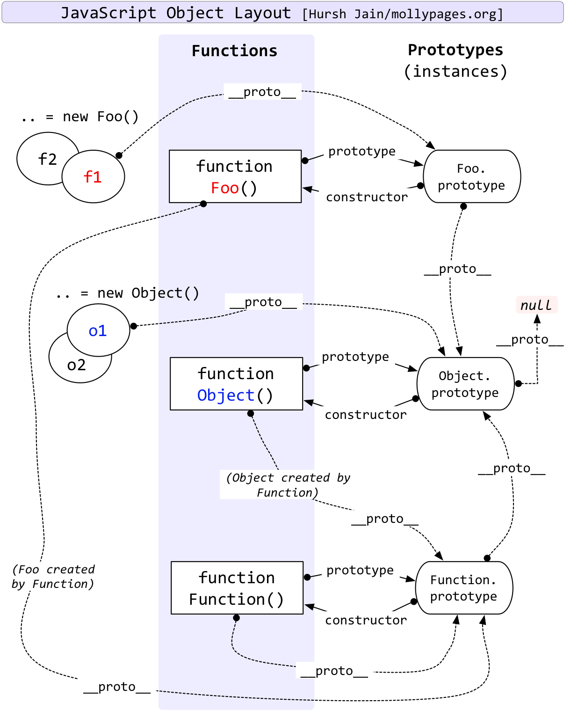

# JavaScript Prototype Inheritance

- [JavaScript Prototype Inheritance](#javascript-prototype-inheritance)
  - [Design Purpose: Code Reuse](#design-purpose-code-reuse)
  - [Reused Object: `prototype`](#reused-object-prototype)
  - [Beautiful API: `class`](#beautiful-api-class)
  - [Search upwards: `__proto__`](#search-upwards-proto)
  - [What is constructor?](#what-is-constructor)
  - [Finally...](#finally)

## Design Purpose: Code Reuse

Requirements:

- Save public data and function
- Cover parent's data and function
- Good API
- Search upwards and use parent's data and function
- Support private data
- Add new member

## Reused Object: `prototype`

```ts
function Animal(this: any, name: string) {
  this.name = name;
  this.getName = function () {
    return this.name;
  };
}

function Cat(this: any, name: string, age: number) {
  Animal.call(this, name);
  this.age = age || 1;
  this.meow = function () {
    return `${this.getName()} eowww ~~~~~~, I'm ${this.age} year(s) old`;
  };
}

const cat = new (Cat as any)('Lily', 2);
console.log(cat.meow());
```

This can:

- Add new member
- Use parent's data and function

Cannot:

- All child's (`Cat`) methods (`getName`, `meow`) are generated a new copy with every instance (`cat`).

Hope:

- All instances inherited from a same object share one single function instance.

How:

- Add a object (`prototype`) in the constructor function and link the methods to this object.
- When the instance methods (`cat.getName()`) are used, JS will looking for it in `Cat.prototype`. Therefore, we don't need to write `cat.prototype.getName()`.

```ts
function theReusedObjectPrototypeC() {
  function AnimalC(this: any, name: string) {
    this.name = name;
  }
  AnimalC.prototype.getName = function () {
    return this.name;
  };

  function CatC(this: any, name: string, age: number) {
    AnimalC.call(this, name);
    this.age = age || 1;
  }
  CatC.prototype = Object.create(AnimalC.prototype as any, { constructor: CatC as any });
  CatC.prototype.meow = function () {
    return `${this.getName()}eowww~~~~~, I'm ${this.age} year(s) old`;
  };
  const catA1 = new (CatC as any)('Lily', 2);
  const catA2 = new (CatC as any)('Lisa', 3);
  console.log(catA1.meow === catA2.meow);
}
```

## Beautiful API: `class`

Why `prototype` is not beautiful?

- `prototype` exposes the implementation mechanism.
- `this` inside of functions depends on using the operator `new`.

Solution with `class`:

```ts
class AnimalD {
  name: string;
  constructor(name: string) {
    this.name = name;
  }
  getName() {
    return this.name;
  }
}

class CatD extends AnimalD {
  age: number;
  constructor(name: string, age: number) {
    super(name);
    this.age = age;
  }
  meow() {
    return `${this.getName()}eowww~~~~~, I'm ${this.age} year(s) old`;
  }
}
const cat1 = new CatD('Lily', 2);
const cat2 = new CatD('Lisa', 3);
console.log(cat1.meow === cat2.meow);
```

Advantages:

- If `new` is forgetten, compiler and JIT will throw error.
- `extends` lets compiler do the prototype inherance.

## Search upwards: `__proto__`

A simple example:

```ts
function AnimalA(this: any, name: string) {
  this.name = name;
}
AnimalA.prototype.say = function () {
  return this.name;
};
const cat1 = new (AnimalA as any)('Kitty');
console.log(cat1.hasOwnProperty('say')); // false
console.log(cat1.say()); // Kitty
```

Since `cat` instance doesn't contain `say()`. How can `cat` search upwards and find `say()` in `Animal.prototype`?

- Plan A: Save a reference pointing to `Animal.prototype` during construction:

```ts
function Animal(name) {
  this.name = name;
  // added automatically
  this.__prototype__ = Animal.prototype;
}
cat.say(); // -> cat.__prototype__.say()
```

- Plan B: Save the type as `Animal` during construction:

```ts
function Animal(name) {
  this.name = name;
  // added automatically
  this.__type__ = Animal;
}
cat.say(); // -> cat.__type__.prototype.say()
```

In reality, JavaScript calls `__proto__` instead of `__prototype__` (Plan A).


As shown in image above, `prototype` is a object saving type's public methods. `__proto__` is used to search the ref upwards. As the endpoint of prototype, `__proto__` of `Object.prototype` is `null`.

## What is constructor?

Basic defination:

- Object: A collection with properties. Every object contains a `__proto__`.
- Function: One property of a function object.
- Constructor: A function object aming to create a object. Every constructor contains a `prototype` for prototype inheritance and property sharing.

> Constructor = Function + `prototype`


## Finally...

Two chains:

- Prototype chain for inherritance. Top is `Object.prototype`; bottom is `null`
- Constructor chain for construction. Top ends with circle `Function`



JS world construction order is:

> `Object.prototype` -> `Function.prototype` -> `Function` -> `Object` -> ...
