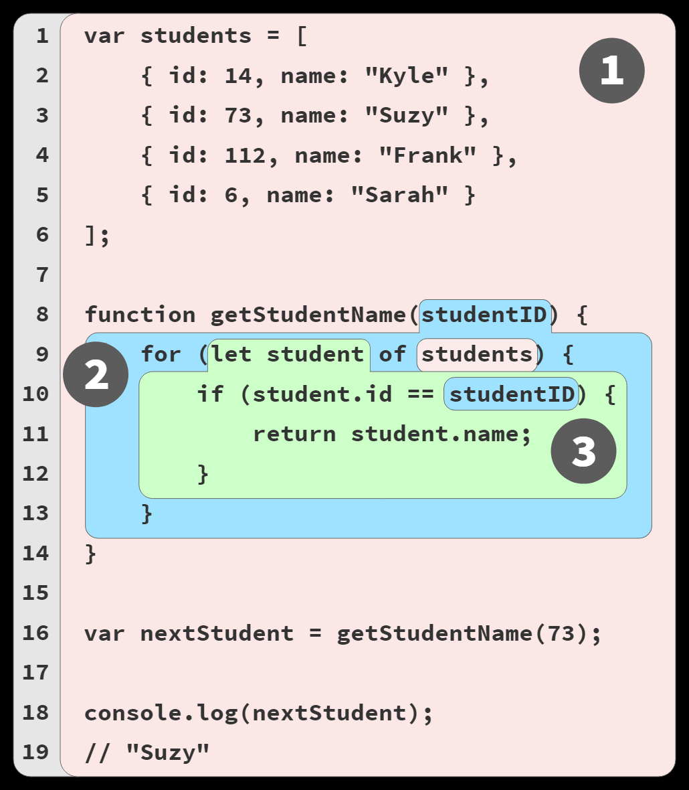
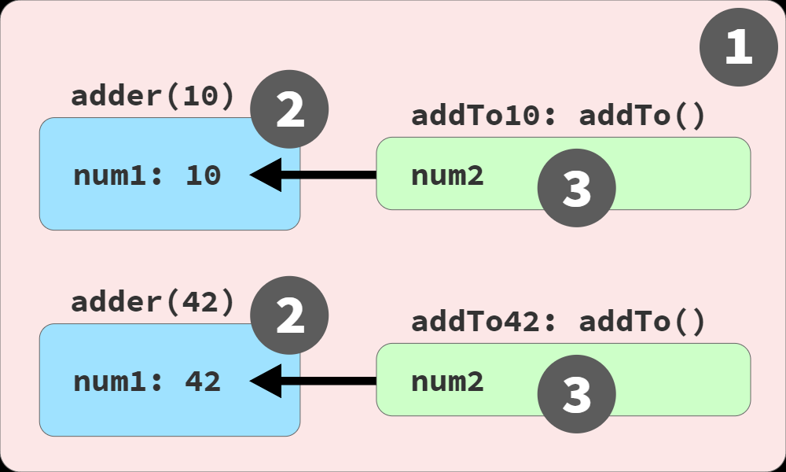
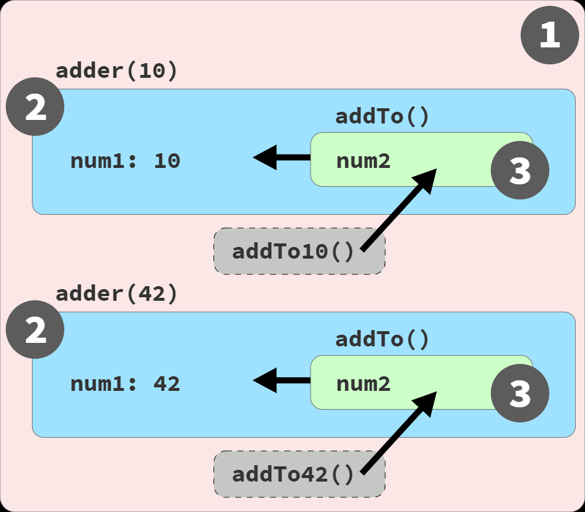

<!-- You don't know JS Edition 2 -->

### JS is most accurately portrayed as a **compiled language**.

### Compiling Code

> `compileThenExecute()`

1. **Tokenizing/Lexing**: breaking up a string into meanningful chunks, called **tokens**.
2. **Parsing**: turn tokens info a tree of nested elements (**Abstract Syntax Tree**).
3. **Code Generation**: AST to binary code.

### Target (LHS) or source (RHS)

1. Declarations:

```js
var students;
```

2. As target of assignment

```js
students = [
  { id: 1, name: 'Kyle' },
  { id: 2, name: 'Suzy' }
];
```

3. As source of a value

```js
for (let student of students)
```

### Lexical Scope

Lexical scope is controlled entirely by the placement of functions, blocks, and variable **declarations**, in relation to one another.

Compilation creates a map of all the lexical scopes used while it executes, which defines all the scopes (lexical environments) and registers all identifiers (variables) for each scope.



### Shadowing

> `shadowing()`

`studentName` identifier reference will correspond to the parameter variable, never the global `studentName` variable.

> `globalUnshadowTricks()`

### `var` and `let`: w/o block scope

> `varAndLet()`

### Function name scope

> `functionNameScope()`

1. When a function (declaration or expression) is defined, a new scope is created.
2. Each new scope offers a clean slate to hold its own set of variables.
3. When a variable name is repeated at different level scopes, shadowing occurs.

## Global Scope

### Why global scope?

How exactly do allseparate files get stitched together in a single runtime context by the JS engine? There are three main ways:

1. ES modules are loaded individually by JS environment.They coorperate with each other through `import`.
2. If a bundler is used, all files are typically concatenated together before delivery to the browser and JS engine. Some mechanism is necessary for each piece of the application to register a **name** to be referred to by other pieces.

```js
(function wrappingOuterScope() {
  var moduleOne = (function one() {
    // ...
  })();

  var moduleTwo = (function two() {
    // ...
    function callModuleOne() {
      moduleOne.someMethod();
    }
  })();
})();
```

3. If there is no single surrounding scope encompassing all these pieces, the **global scope** is the only way for them to cooperate with each other:

```js
var moduleOne = (function one(){
 //  ...
})()
var moduleTwo = (function two(){
  funtion callModuleOne(){
    moduleOne.someMethod()
  }
})()
```

In addition, the global scope is also where:

- JS exposes its built-ins:
  - primitives: `undefined`, `null`, `Infinity`, `NaN`
  - natives: `Date()`, `Object()`, `String()`, etc.
  - global funtions: `eval()`, `parseInt()`, etc.
  - namespace: `Math`, `Atomics`, `JSON`
  - friends of JS: `Intl`, `WebAssembly`
- The environment hosting the JS engine exposes its own built-ins:
  - `console`
  - the DOM: `window`, `document`, etc
  - timer: `setTimeout`, etc
  - web platform APIs: `navigator`, `history`, geolocation, WebRTC, etc

### Where exactly is this global scope?

1. Browser `window`
   1. Globals shadowing globals
   2. DOM Globals

```html
<ul id="my-todo-list">
  <li id="first">Write a book</li>
  ..
</ul>
```

```js
first;
// <li id="first">..</li>

window['my-todo-list'];
// <ul id="my-todo-list">..</ul>
```

If the id value is a valid lexical name (like `first`), the lexical variable is created. If not, the only way to access that global is through the global object (`window[..]`).

2. Web Workers

Web Workers are a web platform extension on top of browser-JS behavior, which allows a JS file to run in a completely separate thread from the main JS thread.

Web Worker code does not have access to the DOM. (And no `window`).

In a Web Worker, the global object reference is typically made using `self`.

3. Develop Tools Console / REPL
4. ES Modules (ESM)

```js
var studentName = "Kyle";

function hello() {
    console.log(`Hello, ${ studentName }!`);
}

hello();
// Hello, Kyle!

export hello;
```

`studentName` and `hello` are not global variables, but "module-global".

5. Node

```js
var studentName = 'Kyle';

function hello() {
  console.log(`Hello, ${studentName}!`);
}

hello();
// Hello, Kyle!

module.exports.hello = hello;
```

Never actually the globally scope. The above function will be wrapped into:

```js
function Module(module,require,__dirname,...) {
    var studentName = "Kyle";

    function hello() {
        console.log(`Hello, ${ studentName }!`);
    }

    hello();
    // Hello, Kyle!

    module.exports.hello = hello;
}
```

## Lifecycle of variables

### Hoisting: Declaration vs. Expression

> `hoisting()`

Notice that the error is not a `ReferenceError`. JS is telling us that `greeting` was found but doesn't hold a function reference at that moment.

### Variable Hoisting

> `variableHosting()`

### Temporal Dead Zone(TDZ)

> `uninitializedVariables()`

## Limiting Scope Exposure

### Hiding in plain scope

> `factorial()`

#### Invoking function expressions immediately

```js
(function () {})();
```

### Scoping with blocks

```js
{
  let thisIsNowAsScope = true;
  // ...
}
```

### Catch block scope

Error in `catch` is block scope limited.

> `catchBlockScope()` > `catch2019BlockScope()`

### Function Declarations in Block

> `functionDeclarationInBlock()`

- Function declaratioins are **block-scoped**.
- But browser JS engines make functions reachable **outside** of blocks.
- If for the sake of performance, override the definition would be better.

> `overrideDefinition()`

## Using Closures

> `closureExample()` > `addingUpClosure()`

### Live link, not a snapshot




Closure is actually a live link, preserving access to the full variable itself.
By closing over a variable in a function, we can keep using that variable (r/w) as long as that function reference exists in the program.

> `liveLinkNotASnapshot()`

Use IIFE to build new function scope.

> `closureInLoops()`

### The Closure Lifecycle and Garbage Collection

Since closure is inherently tied to a function instance, its closure over a variable lasts as long as there is still a reference to that function.

The closure is applied only to the referenced outer variable(s), or does closure preserve the entire scope chain with all its variables?
Per variable.

> `perVariableOrPerScope()`

## The Module Pattern

> `whatIsModule()`

### Namespaces (Stateless Grouping)

is not module.

### Data Structures (Stateful Grouping)

is not module.

### Modules (Stateful Access Control)
